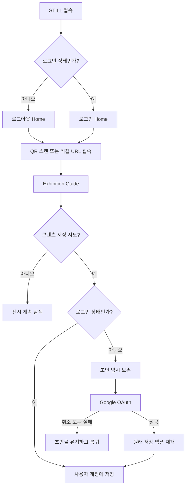
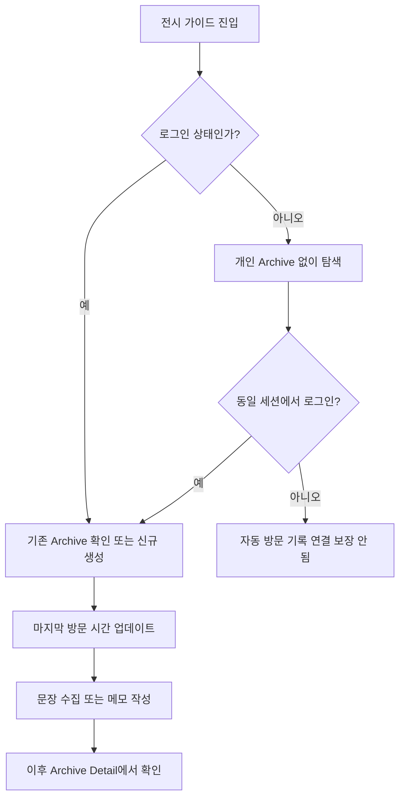
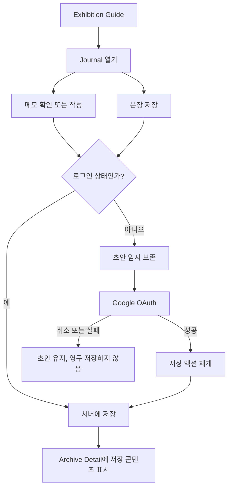
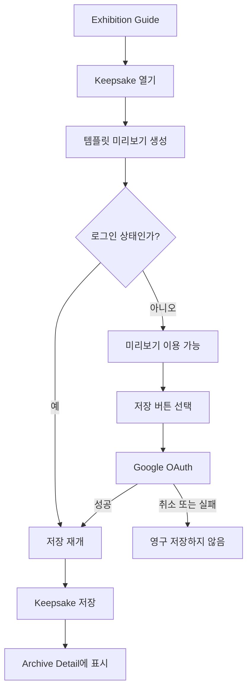
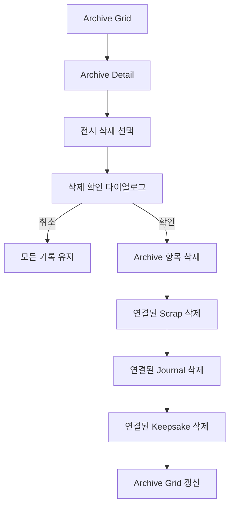

# User Flow

### 7.1 전시 진입 및 인증 (Entry & Authentication)

```mermaid

flowchart TD
    A["STILL 접속"] --> B{"로그인 상태인가?"}
    B -->|아니오| C["로그아웃 Home"]
    B -->|예| D["로그인 Home"]
    C --> E["QR 스캔 또는 직접 URL 접속"]
    D --> E
    E --> F["Exhibition Guide"]
    F --> G{"콘텐츠 저장 시도?"}
    G -->|아니오| H["전시 계속 탐색"]
    G -->|예| I{"로그인 상태인가?"}
    I -->|예| J["사용자 계정에 저장"]
    I -->|아니오| K["초안 임시 보존"]
    K --> L["Google OAuth"]
    L -->|성공| M["원래 저장 액션 재개"]
    M --> J
    L -->|취소 또는 실패| N["초안을 유지하고 복귀"]

```

### 7.2 전시 진입 및 Archive 등록

```mermaid

flowchart TD
    A["전시 가이드 진입"] --> B{"로그인 상태인가?"}
    B -->|예| C["기존 Archive 확인 또는 신규 생성"]
    C --> D["마지막 방문 시간 업데이트"]
    B -->|아니오| E["개인 Archive 없이 탐색"]
    E --> F{"동일 세션에서 로그인?"}
    F -->|예| C
    F -->|아니오| G["자동 방문 기록 연결 보장 안 됨"]
    D --> H["문장 수집 또는 메모 작성"]
    H --> I["이후 Archive Detail에서 확인"]

```

### 7.3 Journal 및 문장 수집

```mermaid

flowchart TD
    A["Exhibition Guide"] --> B["Journal 열기"]
    B --> C["메모 확인 또는 작성"]
    B --> D["문장 저장"]
    C --> E{"로그인 상태인가?"}
    D --> E
    E -->|아니오| F["초안 임시 보존"]
    F --> G["Google OAuth"]
    G -->|성공| H["저장 액션 재개"]
    G -->|취소 또는 실패| I["초안 유지, 영구 저장하지 않음"]
    E -->|예| J["서버에 저장"]
    H --> J
    J --> K["Archive Detail에 저장 콘텐츠 표시"]

```

### 7.4 Digital Keepsake

```mermaid

flowchart TD
    A["Exhibition Guide"] --> B["Keepsake 열기"]
    B --> C["템플릿 미리보기 생성"]
    C --> D{"로그인 상태인가?"}
    D -->|아니오| E["미리보기 이용 가능"]
    E --> F["저장 버튼 선택"]
    F --> G["Google OAuth"]
    G -->|성공| H["저장 재개"]
    G -->|취소 또는 실패| I["영구 저장하지 않음"]
    D -->|예| H
    H --> J["Keepsake 저장"]
    J --> K["Archive Detail에 표시"]

```

### 7.5 Archive 삭제

```mermaid

flowchart TD
    A["Archive Grid"] --> B["Archive Detail"]
    B --> C["전시 삭제 선택"]
    C --> D["삭제 확인 다이얼로그"]
    D -->|취소| E["모든 기록 유지"]
    D -->|확인| F["Archive 항목 삭제"]
    F --> G["연결된 Scrap 삭제"]
    G --> H["연결된 Journal 삭제"]
    H --> I["연결된 Keepsake 삭제"]
    I --> J["Archive Grid 갱신"]

```